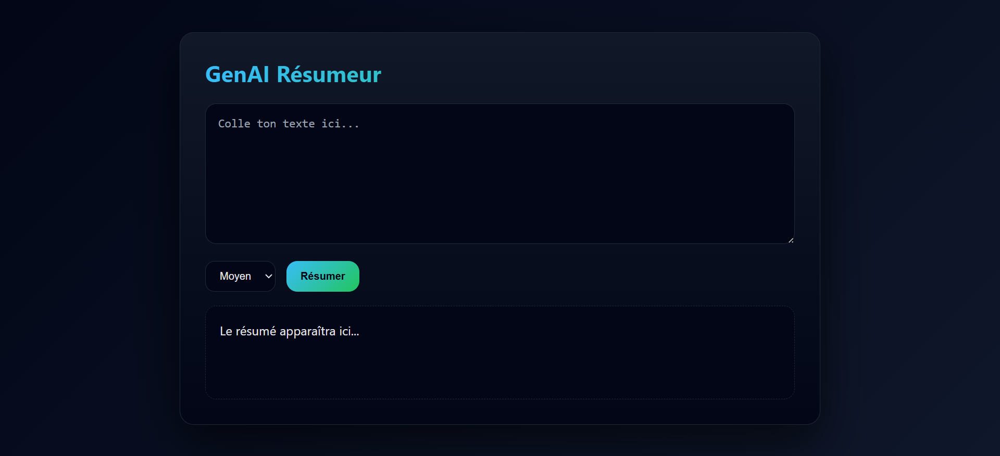

#  GenAI Text Summarizer

A simple and modern **AI-based automatic text summarizer** built using **Node.js**, **Express**, and **Generative AI**.  
This application allows users to paste a text, choose the summary length, and generate a concise summary automatically.

## 📸 Screenshots




## ✨ Features
- 🔹 Automatic text summarization using Generative AI  
- 🔹 Choice of summary length (short / medium / long)  
- 🔹 Modern and responsive user interface  
- 🔹 Backend API built with Node.js and Express  
- 🔹 Secure configuration using environment variables  

---

## 🛠 Technologies Used
- **Node.js**
- **Express.js**
- **JavaScript (ES Modules)**
- **HTML5 / CSS3**
- **Git & GitHub**
- **OpenAI API (Generative AI)**

---

## 📁 Project Structure

---

## 🚀 How to Run the Project Locally

### 1️⃣ Clone the repository
```bash
git clone https://github.com/ghazelaamri/resumeur-genai.git
cd resumeur-genai
npm install
Configure environment variables
Create a .env file in the root directory and add:
API_KEY=your_openai_api_key_here
Start the server
npm start
GO to :http://localhost:3000
    
    
    
    Educational Purpose

This project was developed as part of an academic learning process to understand:

Backend API development

Integration of Generative AI

Client-server communication

Project structuring and version control with GitHub


Author

Ghazela Amri
Computer Science / Software Engineering Student